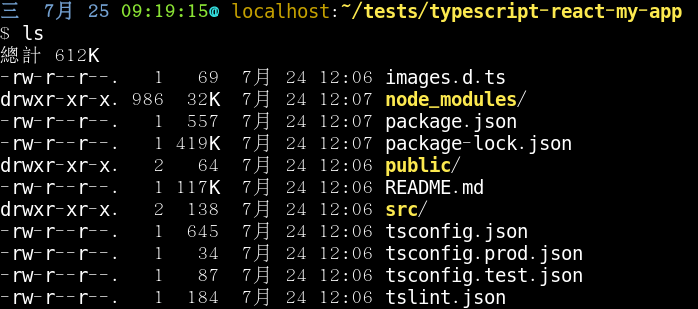
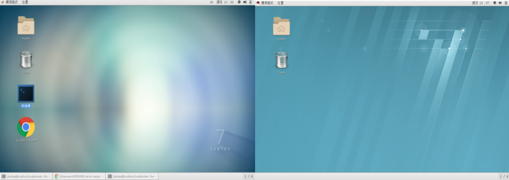
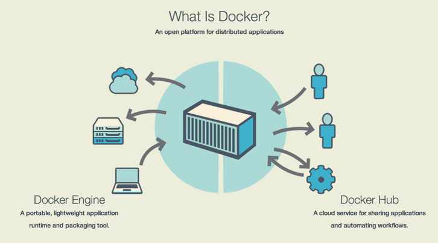
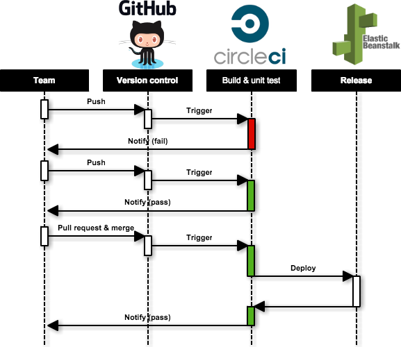

[Image source](http://alma.asiaa.sinica.edu.tw/_img/site_multimedia/2013AOS/IMG_4017.jpg)

[Github.io webpage](https://duidae.github.io/ASIAA-notes/)
## CARTA team
* [Slack](https://cartaviewer.slack.com/messages/C2S1R8V9P/)
* [Trello](https://trello.com/b/fViU1U7v/carta-working-group)

## Weekly progress 2018/10/01~2018/10/07
#### 1. Update casa to lastest version
* casa wiki for build
  * https://safe.nrao.edu/wiki/bin/view/Software/CASA/CasaBuildInstructions
* [雷]Qt重build不會重新產生Makefile,保險是砍掉build/再重來一次...

## Weekly progress 2018/09/24~2018/09/30
#### 1. Test X-Y profile
* ok

#### 2. Study multi-thread(Qt concurrent) for speeding up xy profiler
* https://docs.google.com/document/d/1QBdmaHaCvg6jqpmMLc7e7bWGTrw3F34LtRvIxvkFEk0/edit

## Weekly progress 2018/09/17~2018/09/23
#### 1. Implement X-Y profile
* related files:
  * core/Algorithms/percentileAlgorithms.h
    * MinMaxPercentiles<Scalar>::pixels2histogram(..)
  * core/Data/Image/DataSource.cpp
    * DataSource::_getPixels2HistogramData(..)
* 雷1: 若在NewServerConnector裡解protobuf, 有時會被覆寫導致變成奇怪的message, 但在SessionDispatcher裡不會
* 雷2: SessionDispatcher裡connect signal/slot時, non-primitive的參數要 qRegisterMetaType, slot才收的到
 
#### 2. Modify exception handling of CARTA
#### 3. Check velocity definition
* ok, but better refactor FitsHeaderExtractor.cpp

## Weekly progress 2018/09/10~2018/09/16
#### 1. Trace Region

#### 2. Fix bug
* fits files
  * $ ssh schsu@almat6
  * cd /almalustre/scratch/kswang/hugeImagePool/
  * scp schsu@almat6:/almalustre/scratch/kswang/hugeImagePool/file .

#### 3. Add submodule to backend for protobuf
```
cd carta/cpp/CartaLib/Proto/
git submodule init
git submodule update
git checkout master
```

#### 4. Qt settings
* build
  * NOSERVER=1 CARTA_BUILD_TYPE=bughunter
  * -j2
  * echo
```
`pwd`;

mkdir -p cpp/desktop/CARTA.app/Contents/Frameworks/;
cp cpp/core/libcore.1.dylib cpp/desktop/CARTA.app/Contents/Frameworks/;

rm cpp/core/libcore.1.dylib;
cp cpp/CartaLib/libCartaLib.1.dylib cpp/desktop/CARTA.app/Contents/Frameworks/;

cd ..;
export CARTABUILDHOME=`pwd`;

install_name_tool -change qwt.framework/Versions/6/qwt $CARTABUILDHOME/ThirdParty/qwt-6.1.2/lib/qwt.framework/Versions/6/qwt $CARTABUILDHOME/build/cpp/desktop/CARTA.app/Contents/MacOS/CARTA;
install_name_tool -change qwt.framework/Versions/6/qwt $CARTABUILDHOME/ThirdParty/qwt-6.1.2/lib/qwt.framework/Versions/6/qwt $CARTABUILDHOME/build/cpp/desktop/CARTA.app/Contents/Frameworks/libcore.1.dylib;

install_name_tool -change libcore.1.dylib $CARTABUILDHOME/build/cpp/desktop/CARTA.app/Contents/Frameworks/libcore.1.dylib $CARTABUILDHOME/build/cpp/plugins/ImageStatistics/libplugin.dylib;

install_name_tool -change libCartaLib.1.dylib $CARTABUILDHOME/build/cpp/desktop/CARTA.app/Contents/Frameworks/libCartaLib.1.dylib $CARTABUILDHOME/build/cpp/plugins/ImageStatistics/libplugin.dylib;
install_name_tool -change libcore.1.dylib  $CARTABUILDHOME/build/cpp/desktop/CARTA.app/Contents/Frameworks/libcore.1.dylib $CARTABUILDHOME/build/cpp/desktop/CARTA.app/Contents/MacOS/CARTA;
install_name_tool -change libCartaLib.1.dylib $CARTABUILDHOME/build/cpp/desktop/CARTA.app/Contents/Frameworks/libCartaLib.1.dylib $CARTABUILDHOME/build/cpp/desktop/CARTA.app/Contents/MacOS/CARTA;
install_name_tool -change libCartaLib.1.dylib $CARTABUILDHOME/build/cpp/desktop/CARTA.app/Contents/Frameworks/libCartaLib.1.dylib $CARTABUILDHOME/build/cpp/desktop/CARTA.app/Contents/Frameworks/libcore.1.dylib;

echo "before find";

for f in `find . -name libplugin.dylib`; do install_name_tool -change libcore.1.dylib $CARTABUILDHOME/build/cpp/desktop/CARTA.app/Contents/Frameworks/libcore.1.dylib $f; done;
for f in `find . -name libplugin.dylib`; do install_name_tool -change libCartaLib.1.dylib $CARTABUILDHOME/build/cpp/desktop/CARTA.app/Contents/Frameworks/libCartaLib.1.dylib $f; done;
for f in `find . -name "*.dylib"`; do install_name_tool -change libwcs.5.15.dylib $CARTABUILDHOME/ThirdParty/wcslib/lib/libwcs.5.15.dylib $f; echo $f; done;
```
* run
  * ulimit
    * -n 2000
  * LD LIBRARY PATH
```
/Users/schsu/projects/CARTA/CARTA-backend/carta-backend-sean_add_FILE_INFO/CARTAvis-duidae/ThirdParty/zfp/lib:/Users/schsu/projects/CARTA/CARTA-backend/carta-backend-sean_add_FILE_INFO/CARTAvis-externals/ThirdParty/wcslib/lib:
```

## Weekly progress 2018/09/03~2018/09/09
#### 1. Trace Region
* CARTAvis/newCARTAMeteorApp, 這個repo就有implement client-server model, 從這看region
  * imports/api/Command.js
    * setRegionType, registerRegionControls, closeRegion, regionZoom
  * imports/region/action.js  <- 前端送到後端的動作
  * meteor backend: carta/cjhsu_newArch_profile
* CARTA-release-0.9
  * /html5/common/skel/source/class/skel/Command/Region/CommandRegions.js
  * /html5/common/skel/source/class/skel/widgets/Statistics/StatisticsRegion.js
* Carta::Lib::Regions
* 看ICD region的部分, 前面有use case, 很有幫助
  * SET_REGION
  * SET_REGION_ACK
  * REMOVE_REGION
  * REGION_STATS_DATA
  * REGION_HISTOGRAM_DATA
  
#### 2. Implement frontend feature
* 希望週三搞定

#### 3. Refactor sean's code
* done by Mark

## Weekly progress 2018/08/27~2018/09/02
#### 1. 交接子翔code
* build backend on Mac
  * uWebSocket需要 libssl-dev, libuv
  * boost-python要退版到1.66
  * eigen3.2要另外裝, 從source build, 裝到/usr/local/Cellar/eigen@3.2/3.2.10
  * doxygen要另外裝, $ brew install doxygen
  * carta/scripts/installLibsforcasa.sh()
  * rpfits不用裝
  * 裝flex, bison
    * ci_mac_thrirdparty.sh會裝flex, 尚缺bison
    * ci_mac_common.sh裡有bison
    * [TODO] 這兩個拉出來放到script裡
  * thirdparty build完後要chown, 否則qt load library會權限不足
  * Qt creator -> run -> Run Environment -> DYLD_LIBRARY_PATH 要加上 /Users/schsu/projects/CARTA/CARTA-backend/carta-backend-sean_add_FILE_INFO/CARTAvis-externals/ThirdParty/wcslib/lib:
* build frontend on Mac
  * build_libs.sh 報錯
    * 在build_ast.sh裡加上修改ar為emar, ranlib為emranlib
      * AR=emar RANLIB=emranlib
    * 在zfp/裡修改build/CMakeFiles/3.12.1/CMakeCXXCompiler.cmake ar, ranlib

#### 2. File info 加 FitsHeaderExtractor
* done

## Weekly progress 2018/08/20~2018/08/26
#### 1. Finish command sender
* alt vs MobX: alt的Action <-> state不容易在code裡面觀察出來, 這兩個東西coupling又很強, 造成不好refactoring, 改一個地方不曉得會影響到哪邊然後爛掉, 就這點而言Mobx的decorator是比較好的設計

#### 2. Ask Mark todo
* think possible todo
* Mark: trace region of CARTA, 用中斷點trace
* region: cpp/core/Data/Region
* 接手專案
  * <寫碼容易，讀碼難> 這篇寫的蠻好的 https://www.inside.com.tw/2015/07/26/rework
  * https://itw01.com/GPRE4BG.html
* current project environment, update to wiki:
  * install 3rd party
    1. qmake路徑要加到path
    2. 要加上libuv, libssl
    3. 裝protobuf
    4. create docker image
      * CentOs image
      * gcc & setup libstdc++.so
* current build backend steps on CentOS:
  * 裝新的gcc7
  * sudo yum -y install make cmake git subversion-libs unzip wget openssl-devel libuv-devel
  * 裝qt 5.7
  * gcc, qmake路徑要加到path
  * mkdir CARTAvis-externals
  * mkdir CARTAvis/build
  * install3party.sh
  * install_protobuf+uWebSockets.sh
  * buildCASA.sh
  * ./generate.py
* 待改進
  * 去sudo
* cpp的部份直接用Qt

#### 3. Trace backend
* cpp/desktop
  * desktopMain -> DesktopPlatform -> SessionDispatcher -> NewServerConnector(use protobuf here)

#### 3. others
* TogetherJS
* HealPix + three.js

## Weekly progress 2018/08/13~2018/08/19
#### 1. Finish command sender
* CARTA websocket client: https://github.com/duidae/smart_websocket_client/tree/feat_carta_websocket_client
* [feature]
  * create a React+mobx version
* [fix]
  * protobuf integration problem
  * add respond to history
  * UI adjustment

#### Reference
* ReactJS 101: https://github.com/kdchang/reactjs101
* Javascript promise:
  * https://www.oxxostudio.tw/articles/201706/javascript-promise-settimeout.html
  * http://liubin.org/promises-book/#how-to-write-promise
  * https://eyesofkids.gitbooks.io/javascript-start-es6-promise/content/
* alt
  * https://github.com/goatslacker/alt
* npm trend
  * http://www.npmtrends.com/angular-vs-react-vs-vue
* Flux
  * http://eddychang.me/blog/javascript/94-flux-concept.html

## Weekly progress 2018/08/06~2018/08/12
#### 1. Create command sender
* TS + socket.io chat messeger, good example to start
  * https://github.com/luixaviles/socket-io-typescript-chat
* Websocket server
  * https://github.com/websockets/ws
* Websocket client - fake frontend simulator
  * Simple websocket client(pure js)
    * https://github.com/hakobera/Simple-WebSocket-Client
  * Smart websocket client(React)
    * https://chrome.google.com/webstore/detail/smart-websocket-client/omalebghpgejjiaoknljcfmglgbpocdp
    * github: https://github.com/crysislinux/smart_websocket_client
* WebSocket + Node.js + Express — Step by step tutorial using Typescript
  * https://medium.com/factory-mind/websocket-node-js-express-step-by-step-using-typescript-725114ad5fe4
  * github: https://github.com/JonnyFox/websocket-node-express

#### 2. Build backend
* CentOS @ CERN
  * http://linux.web.cern.ch/linux/centos.shtml
* MAC
  * buildCASA.sh
    * brew install boost, boost-python, fftw
    


## Weekly progress 2018/07/30~2018/08/05
#### 1. Create my own component under current frontend architecture
* MytestComponent, MytestStore in branch "feat-mycomponent"
* examples:
  * [Work with Forms in React](https://medium.com/capital-one-developers/how-to-work-with-forms-inputs-and-events-in-react-c337171b923b)
  * mobx-react form demo: https://foxhound87.github.io/mobx-react-form-demo/demo.html
  * mobx-react todo MVC https://github.com/mobxjs/mobx-react-todomvc
  * mobx-react-typescript https://github.com/mobxjs/mobx-react-typescript-boilerplate
  * mobx dev tool https://github.com/mobxjs/mobx-react-devtools
* working on mytestcomponent as below:


#### 2. Reinstall MAC
* ok
  * [Solved] "could not create a preboot volume for apfs install" problem
    * 網路要好(用網路線)
    * erase Macintosh HD -> reinstall failed
    * command+option+R for internet recovery
    
#### 3. build backend...finally...
* build CASA
  * 用 CARTAvis/carta/scipts/buildaCASA.sh build
  * wcslib <- buildCASA.sh的error缺這個
* build CARTA with Qt
  * -lGL cannot find libGL.so
    * $ cd /urs/lib64
    * $ sudo ln -s libGL.so.1 libGL.so
  * gl/gl.h no such file or directory
    * $ sudo yum install -y mesa-libGL-devel mesa-libGLU-devel // 找不到GL/gl.h问题是少装了gl库
  * [HARD] Undefined reference to google::protobuf::internal::empty_string_[abi:cxx11]
    * 原因: C++ ABI issue. The ABI for std::string has changed in GCC 5 comparing to GCC 4
      * https://gcc.gnu.org/gcc-5/changes.html#libstdcxx
    * compile *.o檔時加上 -D_GLIBCXX_USE_CXX11_ABI=0 這個flag
      * 在 carta/cpp/common.pri 修改 DEFINES += "UseCasacoreNamespace=1 -D_GLIBCXX_USE_CXX11_ABI=0" 
      
```
NewServerConnector.o: 於函式 NewServerConnector::onTextMessage(QString):
/home/duidae/projects/CARTA/CARTA-backend/CARTA-backend-CARTAvis/CARTAvis/carta/cpp/desktop/NewServerConnector.cpp:282: 未定義參考到 google::protobuf::MessageLite::SerializeToString(std::__cxx11::basic_string<char, std::char_traits<char>, std::allocator<char> >*) const
NewServerConnector.o: 於函式 google::protobuf::internal::GetEmptyStringAlreadyInited[abi:cxx11]():
/home/duidae/projects/CARTA/CARTA-backend/CARTA-backend-CARTAvis/CARTAvis/ThirdParty/protobuf/include/google/protobuf/message_lite.h:137: 未定義參考到 google::protobuf::internal::fixed_address_empty_string[abi:cxx11]
/home/duidae/projects/CARTA/CARTA-backend/CARTA-backend-CARTAvis/CARTAvis/build/cpp/desktop/../CartaLib//libCartaLib.so: 未定義的參考到 google::protobuf::internal::WireFormatLite::WriteBytes(int, std::__cxx11::basic_string<char, std::char_traits<char>, std::allocator<char> > const&, google::protobuf::io::CodedOutputStream*)
/home/duidae/projects/CARTA/CARTA-backend/CARTA-backend-CARTAvis/CARTAvis/build/cpp/desktop/../CartaLib//libCartaLib.so: 未定義的參考到 google::protobuf::internal::AssignDescriptors(std::__cxx11::basic_string<char, std::char_traits<char>, std::allocator<char> > const&, google::protobuf::internal::MigrationSchema const*, google::protobuf::Message const* const*, unsigned int const*, google::protobuf::Metadata*, google::protobuf::EnumDescriptor const**, google::protobuf::ServiceDescriptor const**)
/home/duidae/projects/CARTA/CARTA-backend/CARTA-backend-CARTAvis/CARTAvis/build/cpp/desktop/../CartaLib//libCartaLib.so: 未定義的參考到 google::protobuf::internal::WireFormatLite::WriteStringMaybeAliased(int, std::__cxx11::basic_string<char, std::char_traits<char>, std::allocator<char> > const&, google::protobuf::io::CodedOutputStream*)
/home/duidae/projects/CARTA/CARTA-backend/CARTA-backend-CARTAvis/CARTAvis/build/cpp/desktop/../CartaLib//libCartaLib.so: 未定義的參考到 google::protobuf::Message::GetTypeName[abi:cxx11]() const
/home/duidae/projects/CARTA/CARTA-backend/CARTA-backend-CARTAvis/CARTAvis/build/cpp/desktop/../CartaLib//libCartaLib.so: 未定義的參考到 google::protobuf::Message::InitializationErrorString[abi:cxx11]() const
/home/duidae/projects/CARTA/CARTA-backend/CARTA-backend-CARTAvis/CARTAvis/build/cpp/desktop/../CartaLib//libCartaLib.so: 未定義的參考到 google::protobuf::io::CodedOutputStream::WriteStringWithSizeToArray(std::__cxx11::basic_string<char, std::char_traits<char>, std::allocator<char> > const&, unsigned char*)
/home/duidae/projects/CARTA/CARTA-backend/CARTA-backend-CARTAvis/CARTAvis/build/cpp/desktop/../CartaLib//libCartaLib.so: 未定義的參考到 google::protobuf::MessageFactory::InternalRegisterGeneratedFile(char const*, void (*)(std::__cxx11::basic_string<char, std::char_traits<char>, std::allocator<char> > const&))
/home/duidae/projects/CARTA/CARTA-backend/CARTA-backend-CARTAvis/CARTAvis/build/cpp/desktop/../CartaLib//libCartaLib.so: 未定義的參考到 google::protobuf::internal::WireFormatLite::ReadBytes(google::protobuf::io::CodedInputStream*, std::__cxx11::basic_string<char, std::char_traits<char>, std::allocator<char> >*)
/home/duidae/projects/CARTA/CARTA-backend/CARTA-backend-CARTAvis/CARTAvis/build/cpp/desktop/../CartaLib//libCartaLib.so: 未定義的參考到 google::protobuf::internal::WireFormatLite::WriteString(int, std::__cxx11::basic_string<char, std::char_traits<char>, std::allocator<char> > const&, google::protobuf::io::CodedOutputStream*)
collect2: 錯誤：ld 回傳 
```

## Weekly progress 2018/07/23~2018/07/29
#### 1. Trace frontend
* Study frameworks/tools
  * Typescript - 語言
  * React - JS UI library
  * Typescript + React
    * https://github.com/Microsoft/TypeScript-React-Starter
  * MobX - State management
    * https://mobx.js.org/getting-started.html
  * GoldenLayout - UI layout
    * http://golden-layout.com/tutorials/getting-started-react.html
  * Blueprint - UI component
    * http://blueprintjs.com/docs/
    * core - UI元件
    * icon - 圖
    * 看document用比較快
  * 從這些東西的Getting Started去了解最快
* Understand normal structure of Typescript+React:
  * myapp/
    * node_modules/
    * public/: public	 包含了静态资源如HTML页面或图片。除了 	index.html	 文件外,其它的文件都可以删除。
    * src/: 包含了TypeScript和CSS源码。 	index.tsx是强制使用的入口文件。
    * package.json: 包含了依赖,还有一些命令的快捷方式
    * tsconfig.json: TypeScript特定的选项
    * tslint.json: 代码检查器的设置
* Trace CARTA-frontend (Angus's code)
  * Angus應該是用[MS TypeScript React Starter](https://github.com/Microsoft/TypeScript-React-Starter)建構frontend structure, 檔案結構一樣
  
  * src/
    * [X] index.tsx
      * index.tsx是强制使用的入口文件。
    * [X] App.tsx: 設定整個app UI layout(用GoldenLayout)
    * [X] registerServiceWorker.ts
      * Create-React-App產生
      * service worker是在后台运行的一个线程，可以用来处理离线缓存、消息推送、后台自动更新等任务。registerServiceWorker就是为react项目注册了一个service worker，用来做资源的缓存，这样你下次访问时，就可以更快的获取资源。而且因为资源被缓存，所以即使在离线的情况下也可以访问应用（此时使用的资源是之前缓存的资源）。注意，registerServiceWorker注册的service worker 只在生产环境中生效（process.env.NODE_ENV === 'production'）
    * [X] components/
      * Colormap
      * Dialogs
      * ImageView
      * Log: 左下角的Log
      * Menu: 最上面的menu - File, View, Layout, Help
      * Placeholder
      * SpatialProfiler
    * [X] models/
      * MVC的M
      * Point2D, CursorInfo
    * [X] services/
      * BackendService
      * DecompressionService
        * use zfp_wrapper
    * [X] stores/
      * SSOT(Single Source of Truth)：資料統一存放於 Store，View 要資料都需跟 Store 拿。
      * store是儲存應用程式邏輯和狀態資料的地方
  * src下用到mobx, rxjs的地方
    * mobx: app, components, services, stores
    * rxjs: services
  * {CARTA} 在 node_modules/carta-protobuf/ 下面
  * my question
    * 為何不把models/合併到stores/?
      * MVVM? Model, View, Model-View
        * models/ -> M
        * stores/ -> VM
    * store的功用, 怎麼用?
    * 有mobx為何還要用rxjs?
    * protobuf, wasm怎麼接起來的?
      * {CARTA} 在 node_modules/carta-protobuf/ 下面
    * 為何每個指令都有一個對應的function去處理, 而不是統一處理？？
      * 目前指令用protobuf產生的邏輯是寫在BackendService.ts裡, 這是不是可以再封裝起來在一個function or class, ex: sendMessage()?
      * 這樣寫是為了用＠action向Mobx註冊對應的動作

#### 2. Study Related techs
* Facebook - React, create-react-app, Jest
  * React
    * [React note](http://sweeteason.pixnet.net/blog/post/42849617-react-%E5%88%9D%E5%AD%B8%E8%80%85%E7%AD%86%E8%A8%98%E8%88%87%E6%95%99%E5%AD%B8-%28%E4%BA%8C%29---virtual-dom%E3%80%81%E5%85%83%E4%BB%B6)
    * [React tutorial](http://www.runoob.com/react/react-tutorial.html)
  * create-react-app
    * https://github.com/facebook/create-react-app
  * Jest
    * https://jestjs.io/
    * https://github.com/facebook/jest
* Microsoft - Typescript
  * Typescript + React starter
    * https://github.com/Microsoft/TypeScript-React-Starter
* Google - Angular
* Mobx
  * https://cn.mobx.js.org/
* Redux
  * Redux is an open-source JavaScript library for managing application state. It is most commonly used with libraries such as React or Angular for building user interfaces.
* RxJS
  * https://blog.techbridge.cc/2017/12/08/rxjs/
  * RxJs in 30 days: https://ithelp.ithome.com.tw/users/20103367/ironman/1199
* Babel
  * Babel 就是用來轉譯將 JSX 變成 JS 的
* Redux or Mobx
  * http://imweb.io/topic/59f4833db72024f03c7f49b4

#### 3. Study Reactive programming
* 要有Reactive programming的觀念才看得懂React, RxJs, Mobx在幹嘛...
* http://blog.maxkit.com.tw/2015/08/reactive-programming.html
* Functional Programming，那就是 用 function 來思考我們的問題，以及撰寫程式
* Reactive Programming 簡單來說就是 當變數或資源發生變動時，由變數或資源自動告訴我發生變動了
* Functional Reactive Programming(FRP)
  * Reactive Programming，它一般常看到的定義是：讓資料流變化可以自動傳播的程式設計典範
  * FRP使用Functional Programming典範，來實現Reactive Programming
  * https://ithelp.ithome.com.tw/articles/10186104
  * https://www.ithome.com.tw/voice/91328
  * http://xareelee.github.io/tech_note/2016/05/15/why-you-should-learn-FRP.html
  * https://medium.com/@rayshih771012/functional-reactive-programming-70be6bd8726b
  * http://wiki.jikexueyuan.com/project/android-weekly/issue-145/introduction-to-RP.html
* Imperative programming, Functional programming, Reactive programming
  * https://medium.freecodecamp.org/functional-reactive-programming-frp-imperative-vs-declarative-vs-reactive-style-84878272c77f
* Pure function
  * https://medium.com/frochu/%E7%B4%94%E7%B2%B9%E7%9A%84%E5%A5%BD-pure-function-%E7%9F%A5%E9%81%93-574d5c0d7819
    
#### 4. Learn Typescript
* Typescript doc
  * 英文 https://www.typescriptlang.org/docs/home.html
  * 中文 https://www.tslang.cn/docs/home.html
* 什麼是 Duck Typing 與 Strong Typing ?
  * Duck typing
    * Duck Typing: 當看到一隻鳥走起來像鴨子、游泳起來像鴨子、叫起來也像鴨子，那麼這隻鳥就可以被稱為鴨子。
    * 白話 : 物件只要有該型別相同的 property 與 method，就算是該 class 型別。
    * JavaScript 採用的是 duck typing
  * Strong typing
    * 由母鴨生產的鴨子，才算是鴨子。
    * 白話 : 物件必須透過 class 的 new 建立，物件才算是該 class 型別。
* TypeScript 因為要相容 JavaScript，且最後也是編譯成 JavaScript，所以 TypeScript 本質是 duck typing，卻在編譯階段檢查型別是否正確，算是融合 strong typing 與 duck typing。
* .ts vs .tsx
  * .tsx 有用 JSX https://blog.techbridge.cc/2016/04/21/react-jsx-introduction/
  * https://eyesofkids.gitbooks.io/react-basic-zh-tw/content/day15_jsx/
```
<h1>{this.props.text}</h1>
```
  * 那麼這一段是什麼？看起來好像是HTML中的h1標記的寫法，但中間的又好像是JavaScript的程式碼。這種把HTML寫在JavaScript的程式碼中的技術，稱之為JSX語法，是React中很特別的一種語法，它可以讓你把HTML中的各種標記，直接混在JavaScript程式碼中來寫(並不是字串，而是直接使用)。JSX語法在React中是一種必學的語法。當HTML的標記與JavaScript互相混在一起時，為了要標明與執行JavaScript的程式碼，所以用了花括號({})把程式碼的部份括起來。所以this.props.text這一句是JavaScript的程式碼沒錯。
* visible?: boolean;
  * 問號表示visible這個變數是optional
* Arrow function
  * http://oomusou.io/typescript/arrow-function/
* In TypeScript, each member is public by default.

#### 5. Javascript related
* Javascript:
  * [ ] Airbnb javascript style https://github.com/airbnb/javascript
  * javacript tutorial https://developer.mozilla.org/en-US/docs/Web/JavaScript/A_re-introduction_to_JavaScript
  * 建置React開發環境 https://ithelp.ithome.com.tw/articles/10185954
  * online tools
    * codepen https://codepen.io/
    * codesandbox https://codesandbox.io/s/new
* Arrow function
  * https://eyesofkids.gitbooks.io/javascript-start-from-es6/content/part4/arrow_function.html
* functional programming
  * https://ithelp.ithome.com.tw/articles/10186465
* ES6
  * https://medium.com/@peterchang_82818/es6-10-features-javascript-developer-must-know-98b9782bef44
* Javascript @ W3C school
  * https://www.w3schools.com/js
* MDN
  * https://developer.mozilla.org/zh-TW/docs/Web/JavaScript/Reference/Functions/Arrow_functions
* https://eyesofkids.gitbooks.io/javascript-start-from-es6/content/
* Closure
  * 代碼特點：1、函數b嵌套在函數a內部；2、函數a返回函數b。
  * 代碼中函數a的內部函數b，被函數a外面的一個變量c引用的時候，這就叫創建了一個閉包
  * http://easonlin.logdown.com/posts/70026-clouses-in-javascript
  * https://www.jianshu.com/p/c3ea0be9ee96

#### 6. React & Mobx
* react 关注的状态(state)到视图(view)的问题。而 mobx 关注的是状态仓库（store）到的状态(state)的问题。
* Store 和 State 的差別: Store 和 State 其實功能是一樣的，都是用來控制 component 的 UI 狀態。兩者的主要差別，主要體現在 single source of truth，前者是統一資料源的，由一個 store 控制全部的 UI 狀態，而後者是各自 component 保存各自的 state。
* https://codertw.com/ios/19947/
[ ] https://www.youtube.com/watch?v=_q50BXqkAfI

#### 7. Design pattern
* Observer Pattern 觀察者模式
  * 定義物件之間一種一對多的依賴關係，當一個物件狀態發生改變時，所有依賴於他的物件都將自動地得到通知且被更新。
  * https://notfalse.net/10/observer-pattern
* 如何用Typescript實現 Observer Pattern?
  * http://oomusou.io/design-pattern/observer/

#### 8. cooridnate
* Right ascension 赤經
* Declination 赤緯

## Weekly progress 2018/07/16~2018/07/22
#### 1. study gRPC
* gRPC
  * website: https://grpc.io/
  * github: https://github.com/grpc/grpc
    * install guide: https://github.com/grpc/grpc/blob/master/BUILDING.md
#### 2. frame player
* Frame player: https://www.javascripting.com/view/frame-player
  * A video player without video files, just JSON. Based on 'images frames' thought to mobile devices!
  
#### 3. book for designing new acrh of CARTA
* Patterns of Enterprise Application Architecture, Martin Fowler
  * 3 principle layers
    * Presentation layer - how users interact with SW
    * Domain layer - business logic of this SW in certain specific domain
    * Data source layer - communicatoin with data
* websocket book
  * Getting Started with HTML5 WebSocket Programming
    * HTML5 = Markup language + CSS + Javascript
  * https://legacy.gitbook.com/book/abhirockzz/java-websocket-api-handbook/details
* typescript
  * book https://legacy.gitbook.com/book/zhongsp/typescript-handbook/details
  
#### 4. build Angus's frontend on CentOS
* code: https://github.com/idia-astro/carta-frontend
* build problems in CentOS(solved):
  * emcc需要python2.7.12以上的版本, centOS只有2.7.5, 需update python
    * https://www.jianshu.com/p/5420c4299b40
    * https://www.jianshu.com/p/1babc657914c
    * https://blog.fazero.me/2016/10/13/centos-update-python/
  * jre
    * https://www.digitalocean.com/community/tutorials/how-to-install-java-on-centos-and-fedora
  * cmake 太舊
    * http://jotmynotes.blogspot.com/2016/10/updating-cmake-from-2811-to-362-or.html
  * gcc版本太舊(其實應該是動態library libstdc++.so太舊)
    * 升級gcc & link新的libstdc++.so https://blog.csdn.net/furzoom/article/details/53322510
    * https://blog.csdn.net/zr1076311296/article/details/51334538 
* web assembly related library
  * ast
    * A Library for Handling World Coordinate Systems in Astronomy
    * http://starlink.eao.hawaii.edu/starlink/AST
  * zfp
    * zfp is an open source C/C++ library for compressed numerical arrays that support high throughput read and write random access. zfp also supports streaming compression of integer and floating-point data, e.g., for applications that read and write large data sets to and from disk.
    
#### 5. frontend architecture
* MVC archtitecture
  * MVC模式（Model–view–controller）是軟體工程中的一種軟體架構模式，把軟體系統分為三個基本部分：模型（Model）、視圖（View）和控制器（Controller）。
  * Model(資料模型), View(畫面呈現), Controller(流程控制)
* webassembly
  * wasm_libs: ast, zfp library
  * wasm_src: ast, zfp wrapper
* observer design pattern (key part in MVC)
  * https://en.wikipedia.org/wiki/Observer_pattern
  * https://zh.wikipedia.org/wiki/%E8%A7%82%E5%AF%9F%E8%80%85%E6%A8%A1%E5%BC%8F
  
## Weekly progress 2018/07/09~2018/07/15
#### 1. Trace cpp/desktop
* headers
  * GUI - 捨棄Qt後就可以丟掉不管了
    * CustomWebPage.h // X 沒在用了
    * MainWindow.h
    * DesktopPlatform.h
  * communication - 怎麼切換成uwebsockets
    * NewServerConnector.h
    * SessionDispatcher.h  // cjhsu在這測試uwebsocket
    * NetworkAccessManager.h // X 沒在用了
    * NetworkReplyFileq.h  // X 沒在用了
    * websocketclientwrapper.h  // X 從Qt複製過來, 沒在用了
    * websockettransport.h // X 從Qt複製過來, 沒在用了 Qtwebchannel的websocket
  * grep -rn "websockettransport.h" 看有沒人include, 判斷還有沒有在用
  
#### 2. 小實驗完成(週二前) - 試用uwebsocket, protocol buffer, and combine
* 小實驗: https://github.com/duidae/protobuf-uwebsockets
  * 瀏覽器和後端先經protocol buffer壓縮資料和指令，再透過uwebsockets溝通
  * TODO
    * client javascript version
    * server: how to get websocket payload using uWebSockets?
* websocket介紹: http://www.ruanyifeng.com/blog/2017/05/websocket.html
* websocketd: WebSocket daemon
  * http://websocketd.com/
  * github: https://github.com/joewalnes/websocketd/
  * Full duplex messaging between web browsers and servers
  * Avoid threading headaches
  * 是不可以用這個tool來實現我們的架構?
* libwebsockets:
  * https://github.com/warmcat/libwebsockets
* instruction有沒現成class, parser可用 -> 每一種message就是一種instruction, 所以要定義好多種不一樣的Message(instruction)
  * instruction: name+field
  * cjhsu已定義好, 放在CARTAvis/carta/cpp/CartaLib/Proto
* protocol buffer 淺析
  * serialize https://www.cnblogs.com/royenhome/archive/2010/10/30/1865153.html
* websocket 方法與屬性
  * https://developer.mozilla.org/zh-TW/docs/WebSockets/WebSockets_reference/WebSocket
* socket.io: websocket library between Node.js server/browser
  * https://socket.io/
  
#### 3. Architecture
* server:[CASA libs]+[websocket daemon(thread safe)]+[protobuf encoder] ---------ws---------> client
* backend server development includes
  * develop thread safe websocket daemon
  * connect CASA libs with websocket daemon
  * design protocol buffer for instructions/data
* [TODO] google "socket daemon thread safe"

#### 4. 看desktop怎麼跟Qt連接, 怎麼拆除
* 看哪個版本? release?
  * cjhsu的 cjhsu_Proto
* Qt安裝其他版本
  * 用MaintenanceTool裝要sudo,否則會not enough memory...
  * $ sudo ./MaintenanceTool // MaintenanceTool在/opt/Qt裡面

#### 5. coding IDE
* VS code -> 用這
* Eclipse

#### 6. Collaborative Web App
* https://code.tutsplus.com/tutorials/building-a-collaborative-web-app-with-pubnub-reactjs-and-es6--cms-26565
* https://medium.com/@pvh/pixelpusher-real-time-peer-to-peer-collaboration-with-react-7c7bc8ecbf74
* Github搜尋: collaborative
* Mozilla TogetherJS https://togetherjs.com/
  * TogetherJS is a free, open source JavaScript library by Mozilla that adds collaboration features and tools to your website. By adding TogetherJS to your site, your users can help each other out on a website in real time!
* ShareJS: Collaborative editing in any app
  * https://github.com/josephg/ShareJS
* https://medium.com/front-end-hacking/build-a-collaborative-rich-text-editor-with-node-js-and-socket-io-38ee25b6e315
* 本文简单分析一下这种real time cooperative editing system的设计
  * https://zhuanlan.zhihu.com/p/21844666

## Weekly progress 2018/07/02~2018/07/08
#### 1. Report to ASIAA
* ok

#### 2. Trace carta
* read slack
* read Interface Control Document
* architecture:
  * server ----> RPC/data(protobuf encrytion) ------[uwebsocket]------> browser
  
#### 3. test/integration for uWebSockets, protobuf
* uwebsocket: https://github.com/duidae/uWebSockets-example
* protobuf: https://github.com/duidae/protocol-buffer-example
* uwebsocket+protobuf: 
* uWebSockets: micro websocket document很少也新, 或許可以直接用websocket?
* websocket
  * websocket++(C++): https://www.zaphoyd.com/websocketpp
  * websocket(node.js): https://www.npmjs.com/package/websocket

#### 4. HDF5, Redis study
* [intro to HDF5, Redis](https://chtseng.wordpress.com/2017/08/15/%E5%B7%A8%E9%87%8F%E8%B3%87%E6%96%99%E7%9A%84%E5%A5%BD%E5%A4%A5%E4%BC%B4hdf5-redis/)
* HDF5 https://www.hdfgroup.org/
* redis https://redis.io/

#### 5. possible architecture for reference(於瀏覽器多人協作的功能)
* facebook
* slide.com
* google doc
* github(?)

## Weekly report 2018/06/25~2018/07/01
#### 1. Trace carta
* protobuf
  * Branch: mark/newArch-testProtoBuf
  * use protobuf to transmit .fits file
  * structure of .fits file?
  * [TODO] merge scripts/install_protobuf.sh to scripts/install3party.sh
  * carta/cpp/common_config.pri, testProtoBuf.pro
* entry point for protobuf, uwebsockets
  * carta/cpp
  * 學protobuf把uwebsocket整合進去
  * practice: .fits -> (protobuf encrytion) ------[uwebsocket]-----> (protobuf decryption) -> server
* difference between scrips/buildcasa.sh & Mark's script: cmake flag
  * scrips/buildcasa.sh: 多了-DUseCasacoreNamespace=1
```
cmake -DBoost_NO_BOOST_CMAKE=1 -DCASA_BUILD=1 -DBUILD_TESTING=OFF \
     -DUseCasacoreNamespace=1 \
     -DCMAKE_INSTALL_PREFIX=../../$TARGETOS -DBUILD_PYTHON=1 \
     -DPYTHON_INCLUDE_DIR=/usr/include/python2.7 \
     -DPYTHON_LIBRARY=/usr/lib64/libpython2.7.so \
     -DWCSLIB_ROOT_DIR=$cartawork/CARTAvis-externals/ThirdParty/wcslib \
     -DCFITSIO_ROOT_DIR=$cartawork/CARTAvis-externals/ThirdParty/cfitsio \
     -DCMAKE_BUILD_TYPE=Release \
     -DCXX11=1 ..
```
#### 2. Qt related
* qmake會根據專案檔（.pro）裡面的資訊自動生成適合平台的 Makefile
* unit Test for Qt
  * http://doc.qt.io/qt-5/qttestlib-tutorial1-example.html
* [TODO]Use Qt creator to build and debug
* update Qt?

#### 3. study docker for mac
* [docker tutorial](https://github.com/twtrubiks/docker-tutorial)
* [如何安裝 Docker for Mac ?](http://oomusou.io/docker/docker-for-mac/)
* [使用 Docker 快速建立測試環境](http://oomusou.io/docker/ubuntu/)

## Weekly report 2018/06/18~2018/06/24
#### 1. Trace & build carta
* [carta builder script from Mark](https://github.com/markccchiang/CARTA-builder)
* startCarta.sh
  * ulimit: 限制shell資源, -n: 限制開啟文件數目
```
ulimit -n 2000
$CARTAWORKHOME/CARTAvis/build/cpp/desktop/CARTA --html $CARTAWORKHOME/CARTAvis/carta/html5/desktop/desktopIndex.html
```


* release binary
  * CARTA-0.9r-el6-el7/bin/carta.sh <- 啟動點

#### 2. read issues/pull requests
* [protobuf tester](https://github.com/CARTAvis/carta/pull/258)

## Weekly report 2018/06/11~2018/06/17

#### 1. micro web socket study
* [uWebSockets](https://github.com/uNetworking/uWebSockets)
* WebSocket implementation for c++, javascript(Node.js)
* 目前号称最高性能的websocket c++库
* [Comparison of WebSocket implementations](https://en.wikipedia.org/wiki/Comparison_of_WebSocket_implementations)
* possible entry in CARTA? 

#### 2. build carta viewer again on CentOS
* [CARTA viewer](https://github.com/CARTAvis/carta)
* $ sudo ./CARTAvis/carta/scripts/buildcasa.sh
``` 
CMake Error at install/config.cmake:836 (message):
  WCSLIB could not be found.  Please check!
Call Stack (most recent call first):
  CMakeLists.txt:961 (casa_find)
  
  
-- Configuring incomplete, errors occurred!
See also "/home/duidae/projects/CARTA/CARTAvis-externals/ThirdParty/casa/trunk/code/build/CMakeFiles/CMakeOutput.log".
See also "/home/duidae/projects/CARTA/CARTAvis-externals/ThirdParty/casa/trunk/code/build/CMakeFiles/CMakeError.log".
make: *** No targets specified and no makefile found.  Stop.
```
* still errors in make -j2, need to check it out
```
make[3]: Entering directory `/home/duidae/projects/CARTA/CARTAvis/build/cpp/plugins/RegionCASA'
cp -f /home/duidae/projects/CARTA/CARTAvis/carta/cpp/plugins/RegionCASA/plugin.json plugin.json
g++ -c -pipe -DCARTA_RUNTIME_CHECKS=1 -O2 -fopenmp -Wall -W -std=c++0x -D_REENTRANT -fPIC -DUseCasacoreNamespace=1 -DQT_PLUGIN -DQT_GUI_LIB -DQT_CORE_LIB -I/opt/Qt/5.3/gcc_64/mkspecs/linux-g++ -I/home/duidae/projects/CARTA/CARTAvis/carta/cpp/plugins/RegionCASA -I/home/duidae/projects/CARTA/CARTAvis/carta/cpp -I/home/duidae/projects/CARTA/CARTAvis-externals/ThirdParty/casa/trunk/linux/include -I/home/duidae/projects/CARTA/CARTAvis-externals/ThirdParty/casa/trunk/linux/include/casacore -I/home/duidae/projects/CARTA/CARTAvis-externals/ThirdParty/wcslib/include -I/home/duidae/projects/CARTA/CARTAvis-externals/ThirdParty/cfitsio/include -I/home/duidae/projects/CARTA/CARTAvis/ThirdParty/imageanalysis/include -I/opt/Qt/5.3/gcc_64/include -I/opt/Qt/5.3/gcc_64/include/QtGui -I/opt/Qt/5.3/gcc_64/include/QtCore -I. -I. -o RegionCASA.o /home/duidae/projects/CARTA/CARTAvis/carta/cpp/plugins/RegionCASA/RegionCASA.cpp
In file included from /home/duidae/projects/CARTA/CARTAvis/carta/cpp/plugins/RegionCASA/RegionCASA.cpp:1:0:
/home/duidae/projects/CARTA/CARTAvis/carta/cpp/plugins/RegionCASA/RegionCASA.h:9:54: 嚴重錯誤：imageanalysis/Annotations/AnnotationBase.h：沒有此一檔案或目錄
 #include "imageanalysis/Annotations/AnnotationBase.h"
                                                      ^
編譯插斷。
make[3]: *** [RegionCASA.o] Error 1
make[3]: Leaving directory `/home/duidae/projects/CARTA/CARTAvis/build/cpp/plugins/RegionCASA'
make[2]: *** [sub-RegionCASA-make_first] Error 2
make[2]: *** Waiting for unfinished jobs....
g++ -c -pipe -DCARTA_RUNTIME_CHECKS=1 -O2 -fopenmp -Wall -W -std=c++0x -D_REENTRANT -fPIC -DUseCasacoreNamespace=1 -DQT_PLUGIN -DQT_GUI_LIB -DQT_CORE_LIB -I/opt/Qt/5.3/gcc_64/mkspecs/linux-g++ -I/home/duidae/projects/CARTA/CARTAvis/carta/cpp/plugins/ImageStatistics -I/home/duidae/projects/CARTA/CARTAvis/carta/cpp -I/home/duidae/projects/CARTA/CARTAvis-externals/ThirdParty/casa/trunk/linux/include -I/home/duidae/projects/CARTA/CARTAvis-externals/ThirdParty/casa/trunk/linux/include/casacore -I/home/duidae/projects/CARTA/CARTAvis-externals/ThirdParty/wcslib/include -I/home/duidae/projects/CARTA/CARTAvis-externals/ThirdParty/cfitsio/include -I/home/duidae/projects/CARTA/CARTAvis/ThirdParty/imageanalysis/include -I/opt/Qt/5.3/gcc_64/include -I/opt/Qt/5.3/gcc_64/include/QtGui -I/opt/Qt/5.3/gcc_64/include/QtCore -I. -I. -o StatisticsCASARegion.o /home/duidae/projects/CARTA/CARTAvis/carta/cpp/plugins/ImageStatistics/StatisticsCASARegion.cpp
/home/duidae/projects/CARTA/CARTAvis/carta/cpp/plugins/ImageStatistics/StatisticsCASARegion.cpp:4:62: 嚴重錯誤：imageanalysis/ImageAnalysis/ImageStatsCalculator.h：沒有此一檔案或目錄
 #include "imageanalysis/ImageAnalysis/ImageStatsCalculator.h"
                                                              ^
編譯插斷。
make[3]: *** [StatisticsCASARegion.o] Error 1
make[3]: *** Waiting for unfinished jobs....
make[3]: Leaving directory `/home/duidae/projects/CARTA/CARTAvis/build/cpp/plugins/ImageStatistics'
make[2]: *** [sub-ImageStatistics-make_first] Error 2
make[2]: Leaving directory `/home/duidae/projects/CARTA/CARTAvis/build/cpp/plugins'
make[1]: *** [sub-plugins-make_first] Error 2
make[1]: Leaving directory `/home/duidae/projects/CARTA/CARTAvis/build/cpp'
make: *** [sub-cpp-make_first] Error 2
```

#### 3. computer change to MacbookPro
* ok

#### 4. study CASA
* [CASA](https://casa.nrao.edu/)
* running on Redhat 6/7 & Mac OS X
* difference between Redhat/CentOS: CentOS is a community-developed and supported alternative to RHEL(Red Hat Enterprise Linux). It is similar to Red Hat Enterprise Linux but lacks the enterprise-level support. CentOS is more or less a free replacement for RHEL with few minor configuration differences.
* [TODO] build on RHEL

#### 5. install CentOS, RHEL for practice
* ok
* RHEL needs $$, ALMA Taiwan ARC uses CentOS 7.2(ALMA T1~T7)


## Weekly report 2018/06/04~2018/06/10

#### 0. webpage for working progress
* ok
* [webpage](https://duidae.github.io/ASIAA-notes/)

#### 1. Google protocol buffers study
* smaller, faster, binary message structure like json
* protocol buffers: [https://developers.google.com/protocol-buffers/](https://developers.google.com/protocol-buffers/)
* [Overview](https://developers.google.com/protocol-buffers/docs/overview), [Tutorials](https://developers.google.com/protocol-buffers/docs/tutorials), [Github](https://github.com/google/protobuf/releases)
* protobuf install: https://github.com/google/protobuf/blob/master/src/README.md
* .proto defines message strucuture, compiler generates corresponding .h .cc file
* github repo of my practice: [cpp only(modified makefile)](https://github.com/duidae/Asiaa-work/tree/master/protobuf-example)
* possible entry in CARTA? our protobuf message structure?
* good solution for large size json needed encryption

#### 2. qt creator installation 
* ok


#### 3. preparation for report on 7/2
* computer discuss with Mark, spec ok
* necessary materials for Vicky in advance, ok

#### 4. docker study
* docker cookbook, O'reilly


#### 5. DevOps
* really helpful article...[github, CircleCI, docker](http://blog.amowu.com/2015/04/devops-continuous-integration-delivery-docker-circleci-aws-beanstalk.html)


#### 5. how to do open source development/run open source project
* [Innovation Happens Elsewhere (Version 1.0)](https://www.dreamsongs.com/IHE/)

## CARTA team
* Slack: https://cartaviewer.slack.com/messages/C2S1R8V9P/
* Trello: https://trello.com/b/fViU1U7v/carta-working-group

## Reference
* [ALMA](http://www.almaobservatory.org/en/home/)
* [ALMA @ Asiaa](http://alma.asiaa.sinica.edu.tw/index.php)
  * [Fix]deadlink http://almat3.asiaa.sinica.edu.tw/ganglia/
  * Interesting & beautiful, rock band?!! http://alma.asiaa.sinica.edu.tw/intro_multimedia.php
  * AcidMan: ALMA https://www.youtube.com/watch?v=ylEDfirYJaY
* [ALMA kids](http://kids.alma.cl/?lang=zh)
* [ALMA sounds(art)](http://www.almasounds.org/)
* 譬喻：從墾丁看到台北101頂端的一隻金龜子, 看到月球上的高爾夫球
* [CASA](https://casa.nrao.edu/)
* [Code NASA](https://code.nasa.gov/)
* [Data NASA](https://data.nasa.gov/)
* markdown syntax: [mastering markdown](https://guides.github.com/features/mastering-markdown/), [chinese](https://github.com/othree/markdown-syntax-zhtw)

## Open source
* [用Open Source工具開發軟體](http://www.study-area.org/cyril/opentools/opentools/book1.html)
* [Innovation Happens Elsewhere (Version 1.0)](https://www.dreamsongs.com/IHE/)
* [如何貢獻開源專案？](https://shinglyu.github.io/web/2018/05/12/how-to-contribute-to-open-source.html)

## Books:
* lots of free programming books: https://books.goalkicker.com/

## [TODO]
* license study
  * https://github.com/facebook/react/issues/7293
  * https://medium.com/@ji/the-react-license-for-founders-and-ctos-b38d2538f3e5

## Questions
* why not open source CASA directly?

## Related internal docs
* Qt settings
  * https://www.evernote.com/shard/s6/sh/5db2520c-fd9e-481f-b81f-696750eafe97/2e0109f825b155c1
* current CARTA architecture
  * https://docs.google.com/document/d/1nVClqqPpuXeda9Z2G13UGz6aKZZNlGPQGywWd1aVOvM/edit
  
## Project [TODO]
* NewServerconnector.cpp 用 polymorphism refactor
* [Fix] typo/delete/modify in /home/duidae/projects/CARTA/CARTAvis/carta/scripts/buildcasa.sh // 整理buildcasa.sh
    * typo: 3 ## TODO: remove installinging
    * delete: 77     #### install Qt 4.8.5
    * delete: 78     # sudo yum -y install qt-devel.x86_64
    * delete: 79     # alias qmake='qmake-qt4'
    * remove commented code
    * comment註明路徑(casa, casacore)
    * 282 cd ../../code  //是否改成cd $casawork/trunk/code 較易讀
* [Fix] carta/readme.txt -> carta/readme.md // change readme.txt to markdown
* 整理 scripts/carta.sh 
* [Fix] scripts/carta.sh
  * 53     $dirname/setupcartavis.sh 2>&1  > /dev/null  //should be >/dev/null 2>&1
* 用絕對路徑不能rename目錄名稱
* CARTAvis-externals能不能自動化, 每次都要重弄好煩
* 修wiki
